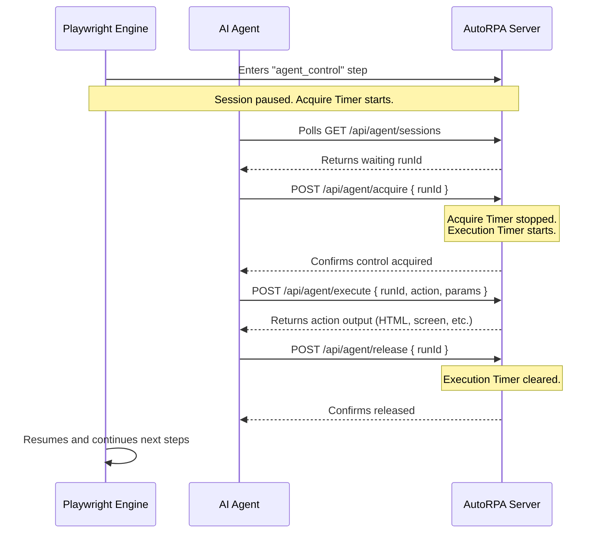

# AutoRPA - AI Integration & Browser Handoff Guide

**AutoRPA** is a modular, high-performance Robotic Process Automation (RPA) and Web Scraping platform. It runs on a Node.js Express backend and uses Playwright to orchestrate headless browser sessions inside Docker containerized environments. It is designed to be highly modular, allowing blocks of action routines to be reused, parameterized, and chained into task pipelines.

This skill guide provides developers and AI agents with the technical details, REST API schemas, JSON request/response examples, and communication protocols required to manage tasks or hijack active browser sessions.

---

## 🏗️ Core Architecture & Concept Model

AutoRPA models web automation around three core concepts:

1. **Action Blocks (Blocos de Ação)**:
   - Reusable modules of automation containing a sequence of browser instructions (steps) such as `navigate`, `click`, `type`, `wait`, `press_key`, `extract_html`, `take_screenshot`, `conditional_if`, and `agent_control`.
   - **Parameters**: Blocks can declare dynamic placeholders inside text parameters using the `{{param:name}}` syntax. Each parameter can define a description and a fallback default value.
   - **Secrets**: Sensitive fields (like passwords) are encrypted simetrically using **AES-256-CBC** and decrypted only in-memory right before browser actions. Log outputs mask these secrets dynamically using `●●●●●●`.

2. **Task Pipelines (Tarefas)**:
   - Pipelines chain multiple instances of Action Blocks sequentially.
   - A single block can be instanced multiple times in the same pipeline (e.g., search for one item, then search for another, using the same "Search" block).
   - Each instance can define static parameter value overrides to customize its behavior.

3. **Schedules (Agendamentos)**:
   - Tasks can be scheduled using standard Crontab expressions (e.g., `0 * * * *` for every hour) powered by an internal scheduler service.

---

## 🔌 API Reference & Request/Response Examples

The AutoRPA server runs on port `3000`. Below are the endpoint details, payloads, and response structures.

### 1. Action Blocks (`/api/blocks`)
* `GET /api/blocks`: Returns list of all defined blocks.
  * **Response (200 OK)**:
    ```json
    [
      {
        "id": "wikipedia-search-and-agent",
        "name": "Wikipedia Search & Agent Handoff",
        "description": "Navega pela Wikipedia, pesquisa por um termo parametrizado e repassa o controle ao agente.",
        "parameters": [
          {
            "name": "termo_de_busca",
            "description": "O termo a ser pesquisado",
            "defaultValue": "Playwright (software)"
          }
        ],
        "secrets": {
          "api_token": "●●●●●●"
        },
        "steps": [
          { "type": "navigate", "url": "https://www.wikipedia.org" },
          { "type": "type", "selector_type": "id", "selector": "searchInput", "text": "{{param:termo_de_busca}}" }
        ],
        "updatedAt": "2026-07-08T00:14:43Z"
      }
    ]
    ```
* `POST /api/blocks`: Create or update an action block.
  * **Request Body**:
    ```json
    {
      "id": "wikipedia-search-and-agent",
      "name": "Wikipedia Search & Agent Handoff",
      "description": "Navega pela Wikipedia, pesquisa por um termo parametrizado e repassa o controle ao agente.",
      "parameters": [
        {
          "name": "termo_de_busca",
          "description": "O termo a ser pesquisado",
          "defaultValue": "Playwright (software)"
        }
      ],
      "secrets": {
        "api_token": "senha_ou_chave_segura"
      },
      "steps": [
        { "type": "navigate", "url": "https://www.wikipedia.org" },
        { "type": "type", "selector_type": "id", "selector": "searchInput", "text": "{{param:termo_de_busca}}" },
        { "type": "click", "selector_type": "class", "selector": ".pure-button-primary-progressive" },
        { "type": "agent_control", "acquireTimeout": 30, "executionTimeout": 60 },
        { "type": "take_screenshot" }
      ]
    }
    ```
  * **Response (200 OK)**: Returns the saved block object (with secrets safely masked in log representations).
* `DELETE /api/blocks/:id`: Delete a block.
  * **Response (200 OK)**: `{ "success": true }`

---

### 2. Task Pipelines (`/api/tasks`)
* `GET /api/tasks`: Returns list of all tasks.
  * **Response (200 OK)**:
    ```json
    [
      {
        "id": "wiki-interactive-pipeline",
        "name": "Wikipedia Interactive Pipeline",
        "description": "Pipeline que faz uma busca estática customizada e delega controle ao agente",
        "blocks": [
          {
            "id": "wiki-search-instance-1",
            "blockId": "wikipedia-search-and-agent",
            "parameterValues": {
              "termo_de_busca": "Artificial Intelligence"
            }
          }
        ],
        "blockIds": ["wikipedia-search-and-agent"],
        "updatedAt": "2026-07-08T00:14:43Z"
      }
    ]
    ```
* `POST /api/tasks`: Create or update a pipeline.
  * **Request Body**:
    ```json
    {
      "id": "wiki-interactive-pipeline",
      "name": "Wikipedia Interactive Pipeline",
      "description": "Pipeline que faz uma busca estática customizada e delega controle ao agente",
      "blocks": [
        {
          "id": "wiki-search-instance-1",
          "blockId": "wikipedia-search-and-agent",
          "parameterValues": {
            "termo_de_busca": "Artificial Intelligence"
          }
        }
      ]
    }
    ```
  * **Response (200 OK)**: Returns the saved task object populated with `blockIds` mapping.
* `POST /api/tasks/:id/run`: Trigger manual run of a task.
  * **Request Body (Optional overrides)**:
    ```json
    {
      "parameterOverrides": {
        "wiki-search-instance-1": {
          "termo_de_busca": "Puppeteer (software)"
        }
      }
    }
    ```
  * **Response (200 OK)**:
    ```json
    {
      "message": "Execution started",
      "taskId": "wiki-interactive-pipeline",
      "runId": "12eb49fd-3bf0-4f92-8a1c-b2d1a4f88f0e"
    }
    ```

---

### 3. Execution History & Logs (`/api/logs`)
* `GET /api/logs`: Returns historical and active execution logs.
  * **Response (200 OK)**:
    ```json
    [
      {
        "id": "12eb49fd-3bf0-4f92-8a1c-b2d1a4f88f0e",
        "taskId": "wiki-interactive-pipeline",
        "taskName": "Wikipedia Interactive Pipeline",
        "status": "success",
        "startedAt": "2026-07-08T00:15:00.123Z",
        "endedAt": "2026-07-08T00:15:20.456Z",
        "stepsExecuted": [
          {
            "blockId": "wikipedia-search-and-agent",
            "blockName": "Wikipedia Search & Agent Handoff",
            "stepIndex": 0,
            "type": "navigate",
            "params": { "url": "https://www.wikipedia.org" },
            "status": "success",
            "startedAt": "2026-07-08T00:15:00.200Z",
            "endedAt": "2026-07-08T00:15:02.300Z"
          },
          {
            "blockId": "wikipedia-search-and-agent",
            "blockName": "Wikipedia Search & Agent Handoff",
            "stepIndex": 1,
            "type": "agent_control",
            "params": { "acquireTimeout": 30, "executionTimeout": 60 },
            "status": "success",
            "startedAt": "2026-07-08T00:15:02.350Z",
            "endedAt": "2026-07-08T00:15:18.100Z",
            "data": { "message": "Controle do agente finalizado com sucesso." }
          }
        ],
        "error": null
      }
    ]
    ```

---

## 🤖 Browser Session Hijacking (Handoff)

When an AutoRPA pipeline executes an `agent_control` step, the runner halts and pauses the browser tab, yielding control to an external agent. As an agent, you must interact with the following endpoints:

### 🔄 Session Control Lifecycle



### 1. Detect Waiting Sessions
Perform a `GET` request to `/api/agent/sessions` (returns all active sessions) or perform a direct lookup by passing a query parameter `/api/agent/sessions?runId=XYZ` (returns the single session or 404).

* **Response (200 OK) for `/api/agent/sessions`**:
  ```json
  [
    {
      "runId": "12eb49fd-3bf0-4f92-8a1c-b2d1a4f88f0e",
      "stepIndex": 1,
      "status": "waiting"
    }
  ]
  ```

* **Response (200 OK) for `/api/agent/sessions?runId=12eb49fd-3bf0-4f92-8a1c-b2d1a4f88f0e`**:
  ```json
  {
    "runId": "12eb49fd-3bf0-4f92-8a1c-b2d1a4f88f0e",
    "stepIndex": 1,
    "status": "waiting"
  }
  ```

### 2. Acquire Control
Perform a `POST` request to `/api/agent/acquire` with the target `runId`.
* **Request Body**: `{ "runId": "12eb49fd-3bf0-4f92-8a1c-b2d1a4f88f0e" }`
* **Response (200 OK)**:
  ```json
  {
    "success": true,
    "status": "acquired"
  }
  ```

### 3. Execute Browser Commands
Perform a `POST` request to `/api/agent/execute` with the `runId`, the `action` to perform, and any required `params`.
* **Request Body Schema**:
  ```json
  {
    "runId": "12eb49fd-3bf0-4f92-8a1c-b2d1a4f88f0e",
    "action": "eval | navigate | click | fill | screenshot | html",
    "params": { ... }
  }
  ```

#### Action-Specific Payloads & Response Examples:

* **`eval`**: Evaluates custom JavaScript in the browser tab.
  * Request:
    ```json
    { "runId": "12eb49fd-...", "action": "eval", "params": { "script": "document.title" } }
    ```
  * Response (200 OK):
    ```json
    { "result": "Wikipedia, a enciclopédia livre" }
    ```

* **`navigate`**: Navigates to a new URL.
  * Request:
    ```json
    { "runId": "12eb49fd-...", "action": "navigate", "params": { "url": "https://duckduckgo.com" } }
    ```
  * Response (200 OK):
    ```json
    { "result": { "success": true } }
    ```

* **`click`**: Clicks a DOM element.
  * Request:
    ```json
    { "runId": "12eb49fd-...", "action": "click", "params": { "selector": "input.pure-button" } }
    ```
  * Response (200 OK):
    ```json
    { "result": { "success": true } }
    ```

* **`fill`**: Fills an input field.
  * Request:
    ```json
    { "runId": "12eb49fd-...", "action": "fill", "params": { "selector": "#searchInput", "value": "AI Agent" } }
    ```
  * Response (200 OK):
    ```json
    { "result": { "success": true } }
    ```

* **`screenshot`**: Capture a page screenshot.
  * Request:
    ```json
    { "runId": "12eb49fd-...", "action": "screenshot", "params": {} }
    ```
  * Response (200 OK):
    ```json
    { "result": { "base64": "data:image/png;base64,iVBORw0KGgoAAA..." } }
    ```

* **`html`**: Returns full raw HTML content of the page.
  * Request:
    ```json
    { "runId": "12eb49fd-...", "action": "html", "params": {} }
    ```
  * Response (200 OK):
    ```json
    { "result": "<!DOCTYPE html><html><head>...</head><body>...</body></html>" }
    ```

### 4. Release Control (Yield back)
Yield control back to resume the pipeline by performing a `POST` request to `/api/agent/release`.
* **Request Body**: `{ "runId": "12eb49fd-3bf0-4f92-8a1c-b2d1a4f88f0e" }`
* **Response (200 OK)**:
  ```json
  {
    "success": true
  }
  ```

---

## 💻 Node.js Takeover Example

Here is a full Javascript script demonstrating how an agent acquires control, reads page titles, navigates to another site, takes a screenshot, and releases control:

```javascript
const BASE_URL = 'http://localhost:3000';

async function performHandoff() {
  // 1. Poll for a session waiting for control
  const sessionsRes = await fetch(`${BASE_URL}/api/agent/sessions`);
  const sessions = await sessionsRes.json();
  const waitingSession = sessions.find(s => s.status === 'waiting');
  
  if (!waitingSession) {
    console.log('No active sessions are waiting for agent control.');
    return;
  }
  
  const runId = waitingSession.runId;
  console.log(`Found waiting session: ${runId}`);

  // 2. Acquire control
  const acquireRes = await fetch(`${BASE_URL}/api/agent/acquire`, {
    method: 'POST',
    headers: { 'Content-Type': 'application/json' },
    body: JSON.stringify({ runId })
  });
  
  if (!acquireRes.ok) {
    console.error('Failed to acquire session');
    return;
  }
  console.log('Control acquired successfully!');

  // Helper to execute commands
  const runCommand = async (action, params = {}) => {
    const res = await fetch(`${BASE_URL}/api/agent/execute`, {
      method: 'POST',
      headers: { 'Content-Type': 'application/json' },
      body: JSON.stringify({ runId, action, params })
    });
    const body = await res.json();
    return body.result;
  };

  // 3. Manipulate the browser
  const title = await runCommand('eval', { script: 'document.title' });
  console.log('Active page title:', title);

  console.log('Navigating to DuckDuckGo...');
  await runCommand('navigate', { url: 'https://duckduckgo.com' });

  const pageHtml = await runCommand('html');
  console.log('HTML Length:', pageHtml.length);

  // 4. Yield control back
  await fetch(`${BASE_URL}/api/agent/release`, {
    method: 'POST',
    headers: { 'Content-Type': 'application/json' },
    body: JSON.stringify({ runId })
  });
  console.log('Session released back to AutoRPA pipeline successfully!');
}

performHandoff();
```
